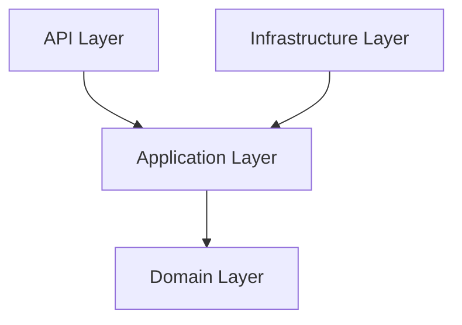

# Shared Kernel

[](https://github.com/juanluiscr27/shared-kernel/releases)
[](https://github.com/juanluiscr27/shared-kernel/actions)
[](https://github.com/juanluiscr27/shared-kernel/actions/workflows/tests.yaml)
[](https://docs.python.org/3.12/index.html)
[](https://mypy-lang.org/)

A Python library that implements the **Shared Kernel** pattern to build projects using **Domain-Driven Design (DDD)** and **Clean Architecture** principles.
---

## 📖 Documentation

We have comprehensive documentation organized according to the **Diátaxis** framework:
*   **[Tutorials](docs/tutorials/getting-started.md)**: Learn by doing. Build your first aggregate and send your first command.
*   **[How-to Guides](docs/how-to/)**: Practical recipes for common tasks like Messaging, Validation, and Persistence.
*   **[Concepts & Explanation](docs/explanation/)**: Deep dives into the Architecture, DDD patterns, and the Error Catalog.
*   **[API Reference](docs/reference/)**: Automatically generated documentation for every module in the library.

💡 You can serve the documentation locally with live-reload:
```bash
pip install mkdocs-material mkdocstrings[python]
mkdocs serve
```

## 🌟 Features

This library provides a standard set of building blocks for sophisticated Python applications:

*   **Core DDD**: Value Objects, Entities, Aggregates, and Domain Events.
*   **Messaging**: Service Bus, in-memory Event Broker, and Event Dispatcher.
*   **CQRS**: Commands, Queries and Handlers.
*   **Validation**: Fail-fast Guard clauses and request-level Validators.
*   **Infrastructure**: Abstract Event Store, Repository Pattern, Projections, and Mapping pipelines.
*   **API Layer**: Standardized Pydantic contracts and Response models.

---

## 🏗️ Architecture Overview

The library facilitates a layered approach where dependencies only point inwards toward the Domain:



---

### Dependencies

Shared Kernel is built using Python 3.12 and depends on the follow libraries:

* [Pydantic](https://github.com/pydantic/pydantic)
* [Result](https://github.com/rustedpy/result)

## Quick Start

### Installation

To install Share Kernel using pip, run:

```shell
pip install git+https://github.com/juanluiscr27/shared-kernel.git@v4.0.0-beta#egg=sharedkernel
```

## Usage

Shared Kernel is ease to use, here we have some examples.

### Value Objects

Define two value objects with the same value. They both should be equal.

```python
from dataclasses import dataclass

from sharedkernel.domain.models import ValueObject


@dataclass(frozen=True)
class Money(ValueObject):
    amount: float = 0
    currency: str = "USD"


# creating two money objects with the same amount and currency value
expected = Money(10, "CAD")

result = Money(10, "CAD")

assert result == expected
```

### Domain Entities

Define two entities with the same ids and they both should be equal.

```python
from dataclasses import dataclass

from sharedkernel.domain.models import Entity, EntityID


@dataclass(frozen=True)
class CountryID(EntityID):
    value: str


class Country(Entity[CountryID]):

    def __init__(self, country_id: CountryID, name: str):
        super().__init__(country_id)
        self.name = name


# defining a strongly typed id for our entities 
do = CountryID("DO")

dr = Country(country_id=do, name="Dominican Rep.")

dom_rep = Country(country_id=do, name="Dominican Republic")

assert dr == dom_rep
```

### Guard Clauses

A guard clause is a software pattern that promotes "failing fast"  
Here we are checking if an email is null or empty and throw a `ValueError` if any are found.

```python
from dataclasses import dataclass

from sharedkernel.domain.models import ValueObject
from sharedkernel.domain.services import Guard


@dataclass(frozen=True)
class Email(ValueObject):
    value: str

    @classmethod
    def create(cls, value: str):
        Guard.is_not_null_or_empty(value)
        return cls(value)


# defining an empty email
empty_email = ""

try:
    _ = Email.create(empty_email)
except ValueError as error:
    print(error)  # Email cannot be null nor empty
```
