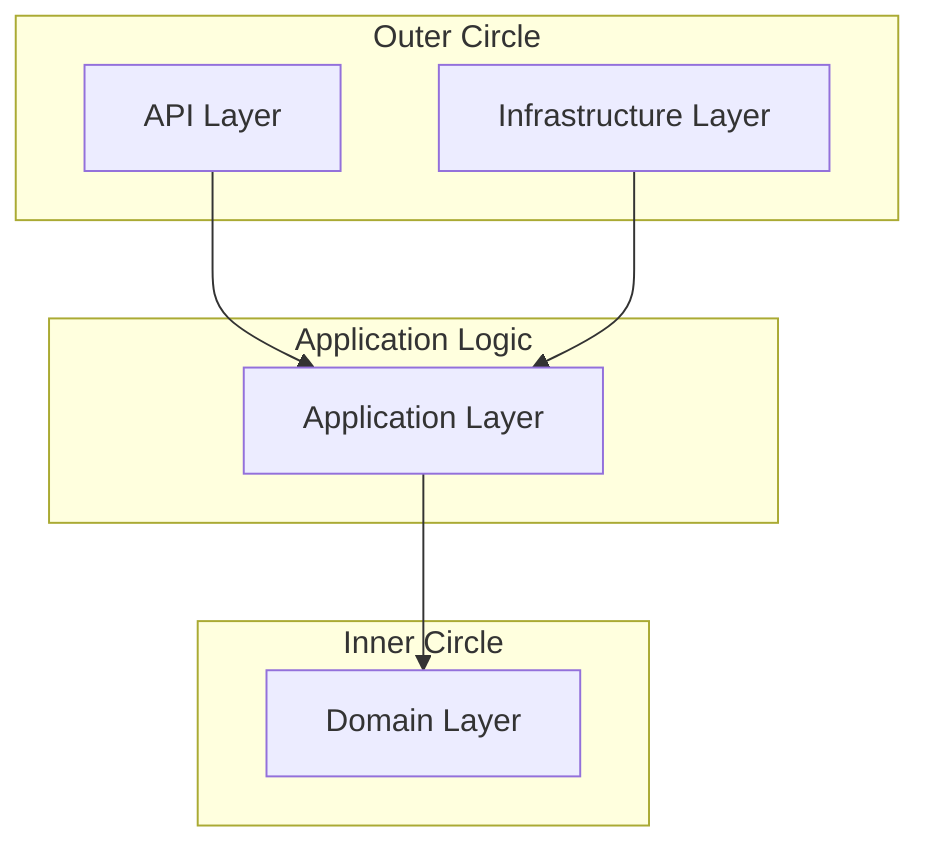

# Architecture Overview

The **Shared Kernel** library is designed to facilitate the implementation of **Clean Architecture** and **Domain-Driven Design (DDD)** in Python projects. It provides a set of abstractions and tools that help decouple business logic from infrastructure concerns.

## The Core Concept: Shared Kernel

In a microservices architecture, different **Bounded Contexts** often need to share certain concepts (e.g., `UserID`, `Money`, or certain `DomainEvents`). Instead of duplicating this code or creating tight coupling between services, a **Shared Kernel** acts as a common library that both contexts agree upon.

## Layered Architecture

The library is organized into layers that communicate following the dependency rule: dependencies only point inwards toward the domain.

### 1. Domain Layer (`sharedkernel.domain`)
The heart of the system. It contains the business logic, entities, and domain events.
- **Models**: `Entity`, `Aggregate`, `ValueObject`.
- **Services**: `Guard` for validation, `DomainService` for cross-aggregate logic.
- **Events**: `DomainEvent` and `DomainEventHandler`.

### 2. Application Layer (`sharedkernel.application`)
Orchestrates the flow of data but contains no business logic.
- **CQRS**: `Command` and `Query` objects.
- **Handlers**: Orchestrate domain objects to fulfill a request.
- **Service Bus**: Purely responsible for routing requests to handlers.

### 3. Infrastructure Layer (`sharedkernel.infrastructure`)
Provides technical implementations for domain/application requirements.
- **Persistence**: `EventStore`, `Repository` interfaces.
- **Messaging**: `EventBroker` for in-memory event publishing.
- **Mapping**: Converting raw data to domain objects.

### 4. API Layer (`sharedkernel.api`)
The entry point for external requests (e.g., via REST or gRPC).
- **Contracts**: Standardized `Request` and `Response` objects using Pydantic.

## Design Patterns

### CQRS (Command Query Responsibility Segregation)
The library strictly separates operations that change state (**Commands**) from those that retrieve state (**Queries**). This allows for optimized read/write paths and clearer intent.

### Event Sourcing
While optional, the library provides first-class support for **Event Sourcing** via the `Aggregate` and `EventStore` abstractions. Instead of storing the current state, you store the sequence of events that led to that state.

### Dependency Inversion
Interfaces (like `Repository`) are defined in the Domain or Application layers, while their concrete implementations reside in the Infrastructure layer. This ensures that business logic is never dependent on database or third-party library choices.
